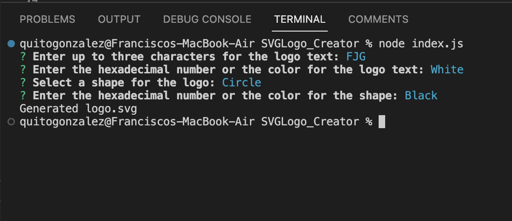
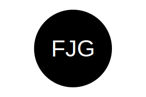

# SVGLogo_Creator

## Table of Contents
- [Description](#description)
- [Installation](#installation)
- [Usage](#usage)
- [Contributing](#contributing)
- [Tests](#tests)
- [Questions](#questions)
- [License](#license)

## Description

This project is designed as a tool to deploy prompts that will finally generate a desired logo by our own desired parameters avoiding adding costs of  hiring a designer to do it for us. This generator should allow users to input text, select colors, and customize the appearance of the logo.

## Installation

First, search for repository on Github called ReadMe_Generator. Then, on the top-right corner, click 'Code' and copy the link. Afterwards, go to VSCode and open the local terminal from the desired parent repostory where you desire to install the generator code. Then, write 'git clone (paste link here)'. Finally, you'll notice the repository has been installed for your convenience. Before making any changes, make sure that the propper dependencies have been downloaded to prevent bugs or functionality issues. 

## Usage

To start generating our Logo, follow the next steps. First, right-click on the parent repository called SVGLogo_Creator and select "Open integrated terminal". Write 'node index.js' on the terminal. Answer all prompts. After all answers have been submitted, you will be notified that the SVG Logo has been created, afterwards notice that it  will also be added to your parent repository. Customize afterwards with your desired requirements for individual projects.

After all dependencies and libraries have been downloaded (inquirer npm and check if Jest is part of the object for unit tests), then, go to the terminal and follow the steps listed above:

a. Go to the terminal and write "node index.js" to initialize application:

b. Answer all queries to save them and create the file:

c. When "Generated logo.svg" is displayed on the terminal, file is created on the parent repository as well:

 

## Example logo created:

## Video Link: 
[For an easier video walkthrough, click this link.](https://app.screencastify.com/manage/videos/37kGKnvtvLRPVvzQkplI)

## Contributing

If you would like to contribute as a developer, you can submit a pull request. Before starting any substantial work, it's recommended to open an issue to discuss your proposed changes with the lead developer.

## Tests

To provide tests, this application is directed by Jest. First, select the parent repository  by right-clicking  on it and selecting "Open in Integrated Terminal". After, write "npm run test" on the command line. 3 tests will run for each class verifying all parameters are correct and symetrical. If the tests fail, verify all dimension, color and shape parameters to change accordingly.

a. Run tests:

b. Make sure tests passed:

## Questions

For any questions, please contact me:

- GitHub: [QuitoMusic](https://github.com/QuitoMusic)
- Email: f86gonzalez@outlook.com

## Refferences

* [Example SVG](https://static.fullstack-bootcamp.com/fullstack-ground/module-10/circle.svg)

* [Scalable Vector Graphics (SVG)](https://en.wikipedia.org/wiki/Scalable_Vector_Graphics)

* [SVG tutorial](https://developer.mozilla.org/en-US/docs/Web/SVG/Tutorial)

* [Basic SVG shapes](https://developer.mozilla.org/en-US/docs/Web/SVG/Tutorial/Basic_Shapes)

* [Text in SVG](https://developer.mozilla.org/en-US/docs/Web/SVG/Tutorial/Texts)

* [SVG VS Code extension](https://marketplace.visualstudio.com/items?itemName=jock.svg)

## License

This project is licensed under the MIT License.
